# Architecture Map

One instruction becomes a mission, a mission becomes tasks, a task runs a
capability, and a capability calls a provider. Everything else — budgets,
approvals, retries, memory — hangs off that spine.

```mermaid
flowchart TD
    OP[Operator] -->|instruction| MGR[Manager Agent]
    MGR -->|plans| MIS[Mission]
    MIS --> TG[Task Graph]
    TG --> ENG[Agent Engine]

    ENG --> AUTH[Authority Check]
    ENG --> BUD[Budget System]
    ENG --> MEM[Business Memory]
    ENG --> CAP[Capability Registry]

    CAP -->|mode ai| ANTH[Anthropic]
    CAP -->|mode provider| PL[Provider Layer]

    PL --> V[Voice]
    PL --> I[Image]
    PL --> S[Stock]
    PL --> R[Renderer]
    PL --> SUB[Subtitles]
    PL --> PUB[Publisher]
    PL --> AN[Analytics]

    ENG -->|raises| APP[Approval System]
    APP -->|operator decides| ENG
    ENG --> DB[(Supabase)]
    AN --> MEM

    style APP fill:#3a2a10,stroke:#f5a524
    style PL fill:#10243a,stroke:#38bdf8
```

## The four rules everything obeys

1. **One engine.** Every capability runs through `lib/agents/engine.ts`. There is
   no second execution path. See [[Mission Engine]].
2. **One workflow per job.** Demo and Production build an identical task graph;
   only the provider implementations differ. See [[Mode System]].
3. **Nothing is simulated in a real workspace.** A missing provider stops the
   step and says what is missing. See [[Provider Layer]].
4. **Nobody approves work they cannot inspect.** See [[Approval System]].

## Layer by layer

| Layer | Owns | Page |
| --- | --- | --- |
| Routing | Turning an instruction into a plan | [[Manager]] |
| Orchestration | Missions, tasks, dependencies | [[Mission Engine]], [[Task Graph]] |
| Execution | Prompt, validate, persist, log, charge | [[Agent Engine]] |
| Integration | Which implementation answers a call | [[Provider Layer]] |
| Governance | Money, permission, gates | [[Budget System]], [[Authority Model]], [[Approval System]] |
| Learning | What the business knows | [[Business Memory]] |
| Persistence | Rows and policies | [[Database]], [[Supabase]], [[Row Level Security]] |
