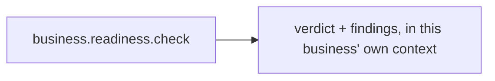

# Business Readiness

> [!info] Definition
> `business_readiness` in `lib/workflows/definitions.ts`

Never created on its own — always as one of [[Operational Readiness]]'s
children, with `business_id` set to the business it checks and
`parent_mission_id` set to the readiness run's parent.

## Diagram

## Steps

One: `check`, capability `business.readiness.check`
(`lib/agents/operations/index.ts`). Provider-mode, no AI call, no cost — reads
whether the business has active agents, a channel or store if its kind needs
one, and a configured budget ceiling.

## Approvals

None.

## Retries

Per step, like any other mission — a retry never reaches outside this
business, because the task, the mission and the check itself all carry the
same `business_id` throughout.

## Expected outputs

A verdict (`ready` or `attention`) and a list of findings in plain English —
never a fabricated score.

## Artifacts produced

Nothing beyond the task's own `output` — read back by
`finalizeReadinessReport()` when the parent mission's report is built.

## Related

- [[Operational Readiness]]
- [[Readiness Auditor]]
