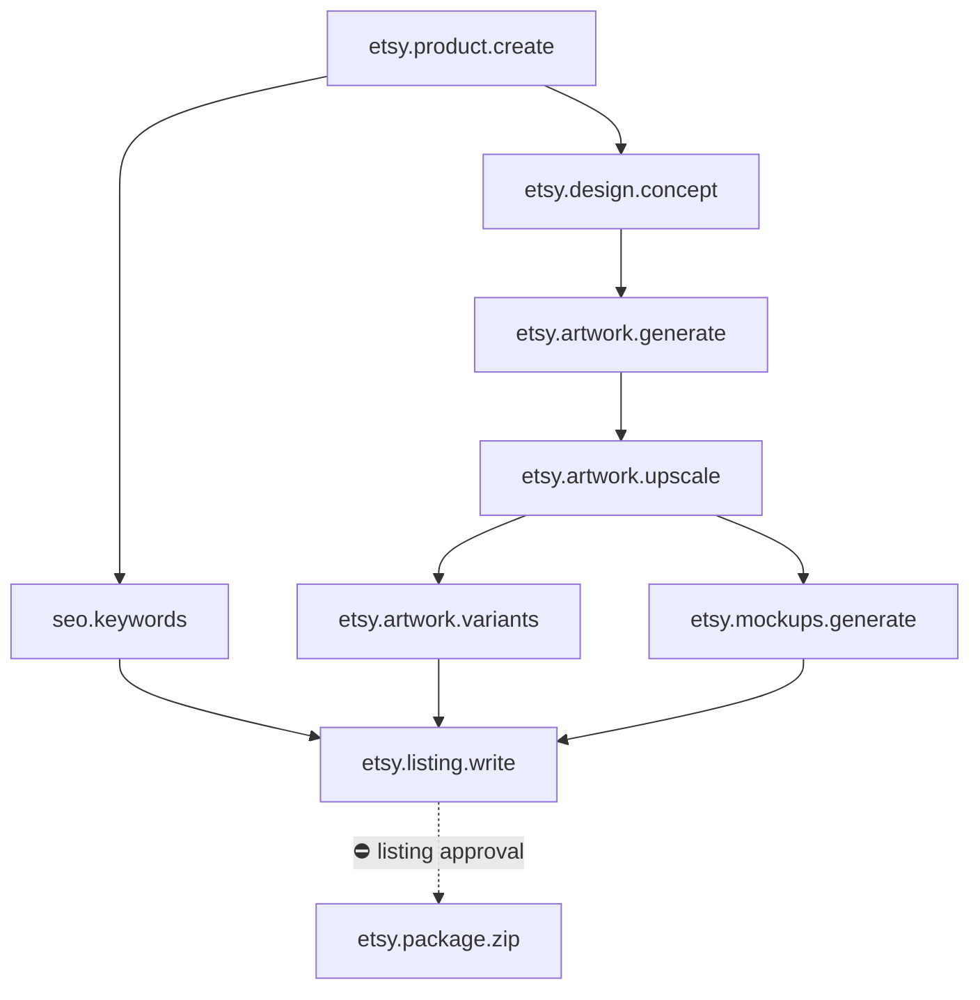

# Etsy Product Build

> [!info] Definition
> `etsy_product_build` in `lib/workflows/definitions.ts`

The complete Etsy production pipeline, built the same way [[Faceless YouTube
Video|youtube_video_full]] was: one workflow, not a demo path and a
production path, with a single provider-mode capability at each generation
step so Demo Mode and a connected account run identical code. Started by
`PATCH /api/etsy/opportunities/[id]` with `start_build: true`, seeded with
`opportunity_id` on every task the same way an approved YouTube idea seeds
`idea_id` onto its script mission.

## Diagram

## Steps

Nine: `create_product`, `design_concept`, `artwork`, `upscale`, `variants`,
`mockups`, `keywords`, `listing`, `package`.

`variants` and `mockups` both depend only on `upscale`, so they are eligible
to run in the same pass; `listing` waits on `keywords`, `variants` and
`mockups` together, so it can describe images that actually exist. `package`
depends on `listing` alone — the same "dependency doubles as an approval
gate" pattern the YouTube pipeline uses after script approval, so nothing is
packaged until the operator has approved what ships.

## Approvals

One: the `listing` approval (kind `listing`). Approving marks the product
`ready`, matches the existing domain effect in
`lib/workflows/approvals.ts::applyDomainEffects` (case `'listing'`), unchanged
by this work.

## Retries

Per step. Every generation step (`etsy.artwork.generate`,
`etsy.artwork.upscale`, `etsy.artwork.variants`, `etsy.mockups.generate`) is
idempotent against the product record it already wrote — a retry checks
`artwork_asset_id` / `upscaled_asset_id` / `variant_asset_ids` /
`mockup_asset_ids` before generating again, so a retried mission does not
regenerate (and re-spend on) work that already succeeded.

## Expected outputs

A design concept, artwork, an upscaled version, three aspect-ratio crops
(`1:1`, `4:5`, `16:9`), two mockup previews, a keyword list, a drafted
listing and — once approved — a zip package of everything.

## Artifacts produced

`etsy_products` (extended with `design_concept`, `artwork_asset_id`,
`upscaled_asset_id`, `variant_asset_ids`, `mockup_asset_ids`,
`package_asset_id`) · `media_assets` (now carries `product_id`, and a new
`archive` type for the zip) · `etsy_keywords` · `etsy_listings`

## What is honestly simulated or approximated

- **Upscaling** is ffmpeg's Lanczos resampling, not AI super-resolution —
  real signal processing, correctly labelled `method: 'ffmpeg-lanczos'` in
  the asset's metadata, not a claim of enhanced detail.
- **Mockups** are a local composite (artwork centred on a matte canvas via
  ffmpeg's `pad` filter), not a photographed physical mockup. Every mockup
  asset's metadata says so in plain words.
- Every asset made by the simulated image provider in Demo Mode is flagged
  `simulated: true` and costs nothing, per [[Provider Layer]].

## Related

- [[Etsy]]
- [[Etsy Product]]
- [[etsy_products]]
- [[ADR-015 Etsy Production Reuses The YouTube Pattern]]
