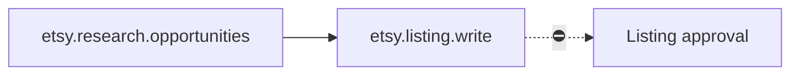

# Etsy Product

> [!info] Definition
> `etsy_product` in `lib/workflows/definitions.ts`

## Diagram

## Steps

Two steps.

## Approvals

A `listing` approval.

## Retries

Per step.

## Expected outputs

A drafted listing.

## Artifacts produced

`etsy_opportunities` · `etsy_listings`

## Related

- [[Etsy]]
