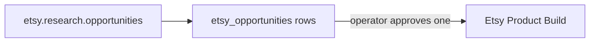

# Etsy Product

> [!info] Definition
> `etsy_product` in `lib/workflows/definitions.ts`

Renamed from a two-step "research then draft" pipeline. Trimmed to research
alone, matching how [[YouTube Ideas|youtube_ideas]] works: this workflow proposes
opportunities, and a separate action — `PATCH /api/etsy/opportunities/[id]`
with `start_build: true` — turns an approved one into a new
[[Etsy Product Build]] mission. One workflow was doing two jobs; splitting
it means a batch of research results is never gated behind one approve/reject
decision for all of them at once.

## Diagram

## Steps

One step: `research`.

## Approvals

None. Opportunities are proposals to browse, not a gate — the decision
happens per-opportunity in `/etsy/opportunities`.

## Retries

Per step.

## Expected outputs

Scored `etsy_opportunities` rows.

## Artifacts produced

`etsy_opportunities`

## Related

- [[Etsy]]
- [[Etsy Product Build]]
