# Faceless YouTube Video

> [!info] Definition
> `youtube_video_full` in `lib/workflows/definitions.ts`

## Diagram

```mermaid
flowchart TD
    R[research] --> S[script]
    S --> F[fact_check]
    F -.->|⛔ SCRIPT APPROVAL| VP[voiceover_plan]
    VP --> V[voiceover]
    V --> VIS[visual_plan]
    VIS --> A[assets]
    F --> TC[thumbnail_concepts]
    TC --> TI[thumbnail_images]
    F --> M[metadata]
    A --> ASM[assembly]
    M --> ASM
    ASM --> SUB[subtitles]
    A --> CR[copyright]
    ASM --> QC[quality_check]
    TI --> QC
    SUB --> QC
    CR --> QC
    QC -.->|⛔ FINAL APPROVAL| PUB[publish]
    PUB --> AN[analytics]

    style F fill:#3a2a10,stroke:#f5a524
    style QC fill:#3a2a10,stroke:#f5a524
    style PUB fill:#3a1010,stroke:#f87171
```

## Steps

| Key | Capability | Depends on | Agent |
| --- | --- | --- | --- |
| `research` | `youtube.research.package` | — | [[Researcher]] |
| `script` | `youtube.script.write` | research | [[Scriptwriter]] |
| `fact_check` | `youtube.script.factcheck` | script | [[Fact Checker]] |
| `voiceover_plan` | `youtube.voiceover.plan` | fact_check | [[Narration]] |
| `voiceover` | `youtube.voiceover.generate` | voiceover_plan | [[Narration]] |
| `visual_plan` | `youtube.visual_plan` | voiceover | [[Visual Planner]] |
| `assets` | `youtube.asset_generate` | visual_plan | [[Asset Agent]] |
| `thumbnail_concepts` | `youtube.thumbnail.concepts` | fact_check | [[Thumbnail]] |
| `thumbnail_images` | `youtube.thumbnail.generate` | thumbnail_concepts | [[Thumbnail]] |
| `metadata` | `youtube.metadata` | fact_check | [[SEO]] |
| `assembly` | `youtube.video_assemble` | assets, metadata | [[Quality Control]] |
| `subtitles` | `youtube.subtitles` | assembly | [[Quality Control]] |
| `copyright` | `youtube.copyright.review` | assets | [[Copyright]] |
| `quality_check` | `youtube.quality_check` | assembly, thumbnail_images, subtitles, copyright | [[Quality Control]] |
| `publish` | `youtube.publish` | quality_check | [[Publisher]] |
| `analytics` | `youtube.analytics.collect` | publish | [[Analytics Agent]] |

## Approvals

Two gates:

1. **Script approval** — raised by `fact_check`. Nothing spends until it clears.
   Reviewed through the script [[Approval Dossier]].
2. **Final approval** — raised by `quality_check`. Reviewed through
   [[Studio Review]], and **disabled without a playable MP4**.

`copyright` blocks the pipeline itself when an asset is `unresolved`.

## Retries

Per step. See [[Retry Engine]] — completed work is never re-run and never re-paid.

## Expected outputs

A playable 1920×1080 MP4, narration, scene assets with recorded provenance,
SRT and VTT, a thumbnail, metadata, a copyright review, a quality report and a
full cost breakdown.

## Artifacts produced

`youtube_research` · `youtube_scripts` + versions · `youtube_fact_checks` ·
`youtube_voiceovers` · `youtube_scenes` · `media_assets` ·
`youtube_thumbnail_concepts` · `youtube_metadata` · `youtube_timelines` ·
`youtube_render_jobs` · `youtube_captions` · `youtube_copyright_reviews` ·
`youtube_quality_checks` · `mission_outcomes`

## Related

- [[YouTube Studio]]
- [[Rendering Pipeline]]
- [[Studio Review]]
- [[Mode System]]
