# Islamic YouTube Video

> [!info] Definition
> `islamic_youtube_video` in `lib/workflows/definitions.ts`

## Diagram

```mermaid
flowchart TD
    R[islamic.research] --> SC[islamic.source_verify]
    SC --> S[script]
    S --> SR[islamic.script_review]
    SR --> F[fact_check]
    F -.->|⛔ SCRIPT APPROVAL| REST[…production]
    style SC fill:#10243a,stroke:#38bdf8
```

## Steps

Research → source verification → script → Islamic script review → fact check → production.

## Approvals

Three gates: the **source gate** (per-claim, cannot be closed while any claim
is unresolved), the script approval, and the final approval.

## Retries

Per step.

## Expected outputs

A sourced script and the ordinary production artifacts.

## Artifacts produced

`islamic_research` · `islamic_source_checks` · `source_resolutions` plus the standard set.

## Related

- [[Islam App]]
- [[Islamic Source Checker]]
- [[source_resolutions]]
