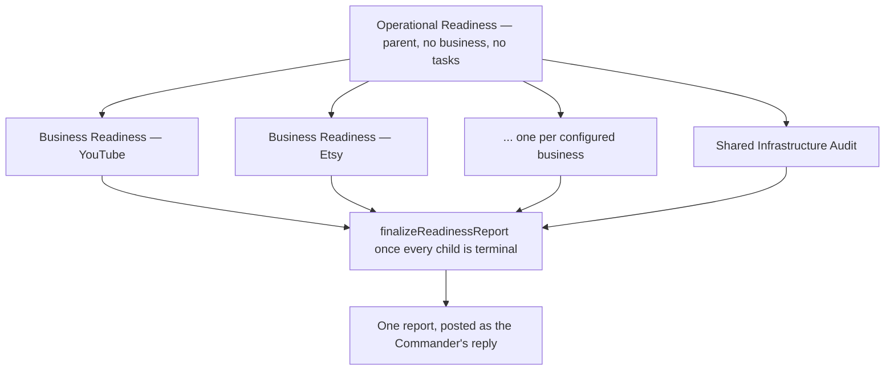

# Operational Readiness

> [!info] Definition
> `lib/workflows/readiness.ts` — not a `WorkflowDefinition`, because its steps
> are not tasks on one mission, they are entire other missions.

Triggered by an instruction the Manager recognises as system-wide — "run an
operational readiness check", "readiness report", "is the system ready" (see
`OPERATIONAL_READINESS` in `lib/agents/manager.ts`) — checked *before* the
ordinary single-mission planning path, because this is never a single
mission.

## Diagram

## Steps

None of its own. The parent mission is created with `allowNoSteps: true` —
its entire job is waiting on its children.

## Fan-out

One [[Business Readiness]] mission per business the owner actually has
(`store.list('businesses', ...)` — never filtered to the first, never
invented when there are none), plus exactly one
[[Shared Infrastructure Audit]] mission, regardless of business count. Every
child gets `parent_mission_id` set to the parent and its own real
`business_id` (or `null`, for the infrastructure one) — never shared, never
guessed.

## Waiting and aggregation

The parent has no tasks, so `recomputeMission()` derives its status from its
children instead (`deriveParentMissionState`, `lib/workflows/engine.ts`) —
any failed child fails the parent; the parent is `completed` only once every
child genuinely is. The moment that happens, wherever it happens — a normal
run or a retry, in any order — `finalizeReadinessReport()` builds one report
from every child's task output and:

- attaches it to the parent's own `context.report`, so it can be found again,
  not just read once in chat
- posts it as a `command_messages` entry from the Manager

## Approvals

None of its own. A child's workflow could gain one later without this
orchestration changing.

## Retries

Per child mission, exactly like an ordinary mission — retrying one never
touches another's tasks, business, or output. See
[[Operational Readiness Fans Out Instead Of Guessing A Business]] for why
this mattered enough to write regression tests for specifically.

Retrying the *parent* now cascades: since it has no tasks of its own, a
retry finds every child that has not reached a terminal state and retries
each of them in turn, reclaiming any stale work first — see [[Task Graph]]
and [[Retry Engine]]. One click on the parent recovers the whole tree.

## Every child completes without a background worker

Each child's own task runs synchronously, in the same request that created
it — `app/api/command/route.ts` calls `runMission` on the parent and every
child immediately after `startOperationalReadiness` returns. Both readiness
capabilities (`system.readiness.audit`, `business.readiness.check`) are
`mode: 'provider'`: no AI call, no cost, and no dependency on
`ANTHROPIC_API_KEY` being configured — they read what is actually
configured (providers, budgets, businesses) the same way the status pages
do. A real workspace's children got stuck `Running` at 0% for hours because
of a separate bug in how a task with no assigned agent was handled, not
because this workflow ever needed a worker process that doesn't exist — see
[[A Missing Agent Left A Readiness Task Queued Forever]] for the full trace
and fix.

## Expected outputs

One report per run, naming every business and shared infrastructure, each
with a verdict (`ready` / `attention` / a mission status) and findings.

## Artifacts produced

`missions` (a parent plus one child per area, linked by `parent_mission_id`) ·
`command_messages` (the final report)

## Related

- [[Business Readiness]]
- [[Shared Infrastructure Audit]]
- [[Capability Scope]]
- [[Mission Engine]]
- [[Task Graph]]
- [[Retry Engine]]
- [[A Missing Agent Left A Readiness Task Queued Forever]]
