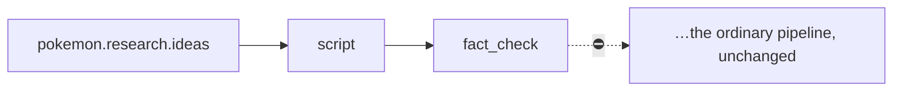

# Pokemon YouTube Video

> [!info] Definition
> `pokemon_youtube_video` in `lib/workflows/definitions.ts`

## Diagram

## Steps

Identical to [[Faceless YouTube Video]] except the first step is `pokemon.research.ideas`.

## Approvals

The same two gates.

## Retries

The same. See [[Retry Engine]].

## Expected outputs

The same, plus `pokemon_opportunities` rows.

## Artifacts produced

As above, plus `pokemon_opportunities`.

## Related

- [[Pokemon Channel]]
- [[Pokemon Researcher]]
- [[Faceless YouTube Video]]
