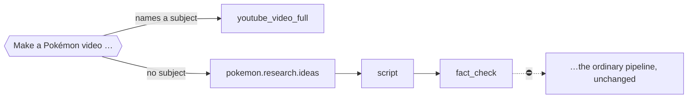

# Pokemon YouTube Video

> [!info] Definition
> `pokemon_youtube_video` in `lib/workflows/definitions.ts`

## Diagram

```mermaid
flowchart LR
    CMD{{"Make a Pokémon video …"}} -->|names a subject| FULL[youtube_video_full]
    CMD -->|no subject| PR[pokemon.research.ideas]
    PR --> S[script] --> F[fact_check]
    F -.->|⛔| REST[…the ordinary pipeline, unchanged]
```

## When it runs

Only when the operator asks for a Pokémon video **without naming a subject**.
"… about X" runs [[Faceless YouTube Video]] instead, so X gets a sourced
research package — see [[ADR-017 A Named Subject Gets A Sourced Research Package]].

## Steps

Identical to [[Faceless YouTube Video]] except the first step is
`pokemon.research.ideas`. `tests/pokemon.test.ts` asserts the rest is identical.

> [!warning] History
> Until 2026-10-09 this page said "identical" while the code stopped at
> `quality_check` — no subtitles, copyright review, publish or analytics. The
> steps had been added to the full pipeline and never carried over.

## Approvals

The same two gates.

## Retries

The same. See [[Retry Engine]].

## Expected outputs

The same, plus `pokemon_opportunities` rows.

## Artifacts produced

As above, plus `pokemon_opportunities`.

## Related

- [[Pokemon Channel]]
- [[Pokemon Researcher]]
- [[Faceless YouTube Video]]
