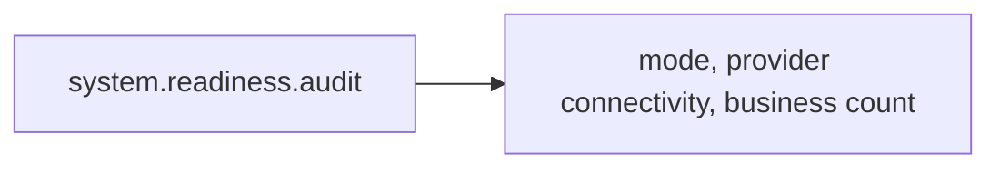

# Shared Infrastructure Audit

> [!info] Definition
> `system_readiness` in `lib/workflows/definitions.ts`

The one [[Operational Readiness]] child with no business — created exactly
once per run, regardless of how many businesses exist, including zero.

## Diagram

## Steps

One: `audit`, capability `system.readiness.audit`
(`lib/agents/operations/index.ts`). Provider-mode, no AI call, no cost —
reads the current mode (`describeMode()`), which of the seven provider
interfaces report connected (`.isConnected()` on each), and how many
businesses are configured. Disconnected providers are only reported as a
finding in Production Mode — Demo and Development are allowed to run without
every provider connected.

## Approvals

None.

## Retries

Per step.

## Expected outputs

A verdict and findings — real numbers read from the mode system and the
provider registry, never estimated.

## Artifacts produced

Nothing beyond the task's own `output`.

## Related

- [[Operational Readiness]]
- [[Readiness Auditor]]
- [[Mode System]]
- [[Provider Layer]]
