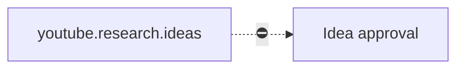

# YouTube Ideas

> [!info] Definition
> `youtube_ideas` in `lib/workflows/definitions.ts`

## Diagram

## Steps

One step.

## Approvals

An `idea` approval.

## Retries

Per step.

## Expected outputs

Scored ideas.

## Artifacts produced

`youtube_ideas`

## Related

- [[Researcher]]
- [[YouTube Studio]]
