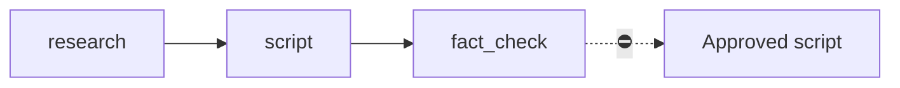

# YouTube Script

> [!info] Definition
> `youtube_script` in `lib/workflows/definitions.ts`

## Diagram

## Steps

Three steps. Used when the operator wants a script without committing to a render.

## Approvals

The script approval.

## Retries

Per step.

## Expected outputs

An approved script.

## Artifacts produced

`youtube_research` · `youtube_scripts` · `youtube_fact_checks`

## Related

- [[Faceless YouTube Video]]
- [[Scriptwriter]]
