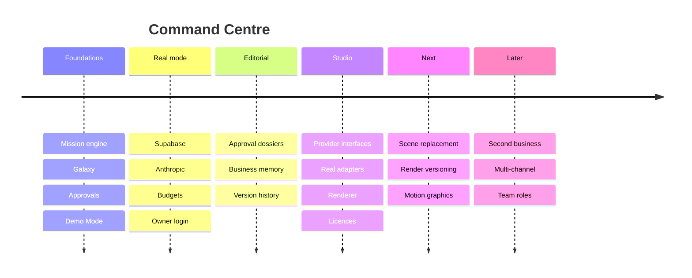

# Roadmap

## Phases

| Phase | Status | Page |
| --- | --- | --- |
| Foundations | done | — |
| Real mode | done | [[Mode System]] |
| Editorial approvals | done | [[Approval Dossier]] |
| Business memory | done | [[Business Memory]] |
| Studio | **current** | [[Current Phase]] |
| Scene control | next | [[Scene Replacement]], [[Render Versioning]] |
| Motion graphics | later | [[One Renderer Not Two]] |
| Scale | later | [[Long Term Vision]] |

See [[Backlog]] and [[Ideas]].
