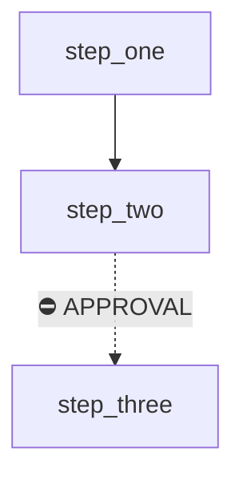

# Workflow Template
> [!note] For a workflow definition


```markdown
---
status: stable
created: YYYY-MM-DD
updated: YYYY-MM-DD
owner: fayaz
summary: One line
key: workflow_key
related: []
tags: [workflow]
---

# <Name>

> [!info] Definition
> `workflow_key` in `lib/workflows/definitions.ts`

## Diagram



## Steps

| Key | Capability | Depends on | Agent |
| --- | --- | --- | --- |

## Approvals
## Retries
## Expected outputs
## Artifacts produced
## Related
```
